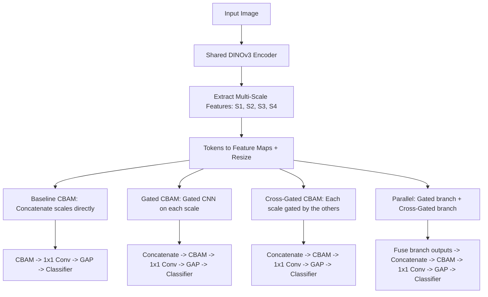

# DINO Multiscale Comparison Report for Three Plant Disease Datasets

## Executive Summary

This report summarizes the comparative performance of DINO multiscale classification variants on three plant disease datasets: `bean_disease_uganda`, `blackgram_leaf_disease`, and `corn_maize_leaf_disease`. The comparison is based on the consolidated results listed in [reports/tables/dino_multiscale_comparison.csv](/home/itartoussi/PlantDiseaseClassification/reports/tables/dino_multiscale_comparison.csv), using test accuracy, macro-F1, and weighted-F1 as the primary evaluation metrics.

Across the three datasets, the strongest-performing model differed by dataset. The `gated_cbam` variant achieved the best result on Bean Disease (Uganda), the `parallel` variant was clearly strongest on Blackgram Leaf Disease, and the `cross_gated_cbam` variant produced the best macro-F1 on Corn/Maize Leaf Disease. This pattern indicates that the benefit of additional multiscale fusion complexity is dataset-dependent rather than universal.

## Evaluation Basis

The report uses the following columns from the comparison file:

- `test_acc`
- `test_f1_macro`
- `test_f1_weighted`
- `is_best_f1_macro`
- `num_parameters`

Macro-F1 is treated as the main selection metric because it better reflects class-balanced performance than accuracy alone, especially when datasets may contain uneven class distributions.

## Preliminary Architecture Diagram

The four solutions compared in this study share the same DINOv3 multiscale feature extractor and differ mainly in how they fuse or refine the extracted scales before classification. A preliminary diagram has been prepared in [dino_multiscale_variants_preliminary.mmd](/home/itartoussi/PlantDiseaseClassification/reports/figures/dino_multiscale_variants_preliminary.mmd).

In short, the `baseline_cbam` model applies attention after simple multiscale concatenation, `gated_cbam` adds scale-wise gated refinement before fusion, `cross_gated_cbam` uses cross-scale context to modulate each branch, and `parallel` combines both gated local refinement and cross-gated interaction before the final classifier.

## Consolidated Results

| Dataset | Model | Parameters | Accuracy | Macro-F1 | Weighted-F1 | Best by Macro-F1 |
|---|---|---:|---:|---:|---:|---|
| Bean Disease (Uganda) | baseline_cbam | 22.67M | 0.812 | 0.813 | 0.813 | No |
| Bean Disease (Uganda) | gated_cbam | 33.30M | 0.898 | 0.899 | 0.899 | Yes |
| Bean Disease (Uganda) | cross_gated_cbam | 23.86M | 0.848 | 0.847 | 0.846 | No |
| Bean Disease (Uganda) | parallel | 34.48M | 0.751 | 0.751 | 0.751 | No |
| Blackgram Leaf Disease | baseline_cbam | 22.68M | 0.224 | 0.073 | 0.082 | No |
| Blackgram Leaf Disease | parallel | 34.48M | 0.737 | 0.732 | 0.736 | Yes |
| Corn/Maize Leaf Disease | baseline_cbam | 22.67M | 0.905 | 0.879 | 0.905 | No |
| Corn/Maize Leaf Disease | gated_cbam | 33.30M | 0.915 | 0.889 | 0.915 | No |
| Corn/Maize Leaf Disease | cross_gated_cbam | 23.86M | 0.918 | 0.898 | 0.920 | Yes |
| Corn/Maize Leaf Disease | parallel | 34.48M | 0.915 | 0.894 | 0.915 | No |

## Dataset-Level Analysis

### 1. Bean Disease (Uganda)

Bean Disease (Uganda) shows the clearest advantage for the `gated_cbam` model. With a test accuracy of 0.898 and a macro-F1 of 0.899, it outperformed all other variants by a meaningful margin. Compared with the `baseline_cbam` model, the gain in macro-F1 is approximately 0.086, which is substantial for a classification benchmark of this scale.

The `cross_gated_cbam` model remained competitive, but it did not match the gated variant. The `parallel` model performed worst on this dataset despite having the largest parameter count, suggesting that the additional representational capacity did not translate into better generalization here. For Bean Disease (Uganda), the results support the view that adaptive feature selection through gating is more useful than simply increasing fusion capacity.

### 2. Blackgram Leaf Disease

Blackgram Leaf Disease presents the largest performance gap among the reported runs. The `parallel` model achieved 0.737 accuracy and 0.732 macro-F1, while the `baseline_cbam` model reached only 0.224 accuracy and 0.073 macro-F1. This difference is dramatic and suggests that the more expressive multiscale fusion strategy is especially valuable for this dataset.

At the same time, the current comparison file contains only two Blackgram variants: `baseline_cbam` and `parallel`. Because `gated_cbam` and `cross_gated_cbam` are not included in this table, the result should be interpreted as a partial comparison rather than a complete ranking of all four model types. Even with that limitation, the available evidence strongly indicates that the `parallel` variant is far more effective than the baseline for Blackgram classification.

### 3. Corn/Maize Leaf Disease

Corn/Maize Leaf Disease produced strong results across all four reported variants, with every model reaching at least 0.879 macro-F1 and at least 0.905 weighted-F1. The best macro-F1 was obtained by `cross_gated_cbam`, which achieved 0.898 macro-F1 and 0.918 accuracy. However, the gap between the best and weakest model on macro-F1 is relatively small, at roughly 0.019.

This narrow spread suggests that Corn/Maize Leaf Disease is comparatively stable across architecture choices in the current experimental setting. Although `cross_gated_cbam` ranked first, `gated_cbam` and `parallel` were close behind, and even the baseline remained highly competitive. In practical terms, this means model selection for Corn may be influenced not only by performance but also by parameter efficiency and deployment constraints.

## Cross-Dataset Observations

Several broader conclusions emerge from the three-dataset comparison.

- No single architecture is best on every dataset.
- Additional model complexity helps in some cases, but not uniformly.
- Macro-F1 and accuracy tell a consistent story across all three datasets.
- Larger parameter counts do not automatically produce better results.

The strongest example of dataset sensitivity is the contrast between Bean and Blackgram. On Bean, `gated_cbam` is best and `parallel` is worst. On Blackgram, the opposite pattern appears in the reported results, with `parallel` clearly outperforming the baseline. On Corn, the models cluster closely together, indicating that architectural changes matter less there than on the other two datasets.

## Interpretation

From a modeling perspective, the results suggest that different datasets benefit from different forms of multiscale interaction. The `gated_cbam` variant appears well suited to settings where selective emphasis of informative features is important, as seen in Bean Disease (Uganda). The `parallel` variant appears advantageous when richer multibranch representations are needed, as suggested by the strong Blackgram outcome. The `cross_gated_cbam` variant shows its strength on Corn/Maize, where careful cross-scale coordination may provide a modest but consistent edge.

These findings are useful for both research and deployment. For research, they indicate that architectural evaluation should be dataset-specific rather than guided by a single global winner. For deployment, they suggest that model choice should depend on the target crop and operating constraints instead of assuming that the most complex network will always be best.

## Limitations

- The report is derived from the current contents of `dino_multiscale_comparison.csv`.
- Blackgram Leaf Disease currently includes only two reported model variants in that file.
- The report evaluates final test metrics only and does not analyze variance across repeated runs or folds.
- No statistical significance testing is available from the current table alone.

## Conclusion

The three-dataset comparison demonstrates that DINO multiscale variants behave differently across plant disease benchmarks. `gated_cbam` is the strongest option for Bean Disease (Uganda), `parallel` is the strongest among the reported Blackgram runs, and `cross_gated_cbam` leads on Corn/Maize Leaf Disease. The overall conclusion is not that one fusion design dominates universally, but that the best-performing architecture depends on the structure and difficulty of the dataset being modeled.
